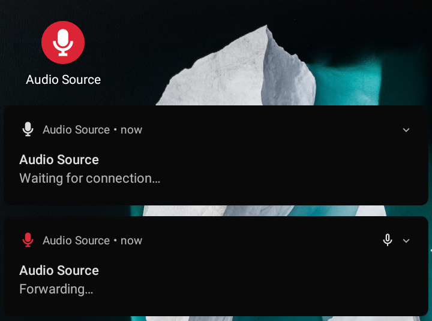

# Audio Source

Audio Source forwards Android microphone audio input to the PulseAudio daemon
through ADB, so you can use your Android device as a USB microphone.



## Requirements

- Device with at least Android 4.0 (API level 14), but fully tested only on
  Android 10 (API level 29) so your mileage may vary.
- GNU/Linux machine with:
  - Android SDK Platform Tools (requires `adb` in `PATH`).
  - PulseAudio or PipeWire with PulseAudio support (requires `pactl` in
    `PATH`).
  - Python 3 (requires `python3` in `PATH`).

## Installation

[](https://f-droid.org/packages/fr.dzx.audiosource/)
[](https://github.com/gdzx/audiosource/releases/latest)

1. Install the Audio Source APK on your Android device through
   [F-Droid](https://f-droid.org/packages/fr.dzx.audiosource/), or from the
   [releases](https://github.com/gdzx/audiosource/releases/latest), or by
   following the [build instructions](#build-and-install).
2. Download the
   [`audiosource`](https://github.com/gdzx/audiosource/blob/master/audiosource)
   client script on your computer from the
   [releases](https://github.com/gdzx/audiosource/releases/latest), and mark it
   executable with `chmod a+x ./audiosource`.

## Usage

1. Enable *Android Debug Bridge* (ADB) from the *Developer options* and connect
   the device(s) to your computer.

2. Run `./audiosource run` to start Audio Source and forward the audio
   automatically. You may have to grant the permission to record audio in
   Android.

   **NOTE:** If you have multiple devices connected then you will have to
   specify the serial number of the device you would like to forward audio to
   with `./audiosource run -s SERIAL` (device serial numbers can be found by
   running `adb devices`).

   Additionally, you may override the default PulseAudio source name with
   `./audiosource run -n NAME`. Otherwise, a default name of
   `audiosource<RANDOM_UUID>` will be used.

   You can also utilize job control to connect multiple devices to PulseAudio
   simultaneously.

   ```
   $ ./audiosource run -s SERIAL_ONE > /dev/null &  // press ENTER to regain control of your terminal
   $ ./audiosource run -s SERIAL_TWO > /dev/null &
   ```

3. Run `./audiosource volume NAME LEVEL` to set the PulseAudio source volume to
   `LEVEL` (for instance `200%`). You will likely need to set the volume higher
   than `100%`.

## Build and install

Run `./gradlew tasks` to list the available commands.

### Debug

```shell
$ ./audiosource build
$ ./audiosource install
```

or if multiple devices are connected:

```shell
$ ./audiosource build
$ ./audiosource install -s SERIAL
```

### Release

1. Generate a Java KeyStore:

   ```shell
   $ keytool -keystore /home/user/android.jks -genkey -alias release \
          -keyalg RSA -keysize 2048 -validity 30000
   ```

2. Create `keystore.properties` in the project root directory containing:

   ```
   storeFile=/home/user/android.jks
   storePassword=STORE_PASS
   keyAlias=release
   keyPassword=KEY_PASS
   ```

3. Build and install:

   ```shell
   $ export AUDIOSOURCE_PROFILE=release
   $ ./audiosource build
   $ ./audiosource install
   ```

   or with multiple devices connected:

   ```shell
   $ export AUDIOSOURCE_PROFILE=release
   $ ./audiosource build
   $ ./audiosource install -s SERIAL
   ```

## Acknowledgement

[sndcpy](https://github.com/rom1v/sndcpy) for the initial implementation of
audio playback forwarding.

## License

This project is licensed under the MIT license ([LICENSE](LICENSE) or
http://opensource.org/licenses/MIT).
