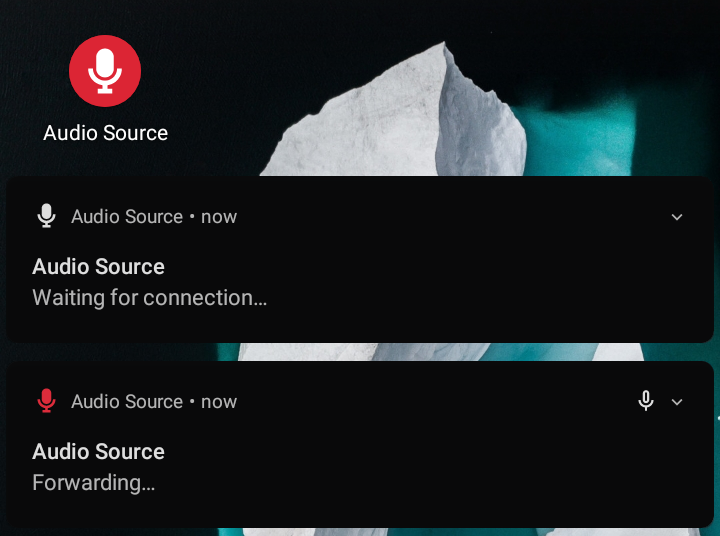

# Audio Source
Audio Source forwards Android microphone audio input to the PulseAudio daemon  
through ADB, so you can use your Android device as a USB microphone.



## Requirements
- Device with at least Android 4.0 (API level 14), but fully tested only on  
  Android 10 (API level 29) so your mileage may vary.
- GNU/Linux machine with:
  - Android SDK Platform Tools (requires `adb` in `PATH`).
  - PulseAudio or PipeWire with PulseAudio support (requires `pactl` in  
    `PATH`).
  - Python 3 (requires `python3` in `PATH`).

## Installation
1. **On your Android device**:
   - Go to **Settings → About phone** → tap **Build number** 7 times to enable Developer options.
   - Go to **Settings → System → Developer options** → enable **USB debugging** (Android Debug Bridge).
   - Install the Audio Source app:
     - Recommended: Get it on [F-Droid](https://f-droid.org/packages/fr.dzx.audiosource/)  
       [](https://f-droid.org/packages/fr.dzx.audiosource/)
     - Or download the APK from the [GitHub releases](https://github.com/gdzx/audiosource/releases/latest)  
       [](https://github.com/gdzx/audiosource/releases/latest)
     - Or build from source (see [Build and install](#build-and-install) below).

2. **On your Linux PC**:
   - Download the `audiosource` client script from the [latest release](https://github.com/gdzx/audiosource/releases/latest) (look for the file named `audiosource` in the assets section).
   - Open the folder where you downloaded the script.
   - Open a terminal in that folder (right-click → Open in Terminal, or use `cd` command).
   - Make the script executable:
     ```bash
     chmod a+x ./audiosource
     ```

## Usage
1. Connect your Android device to your PC via USB cable.
2. On your phone, when prompted, **allow USB debugging** and grant microphone/recording permission to the Audio Source app (it may appear when you start forwarding).
3. In the terminal (in the folder with the script), run:
   ```bash
   ./audiosource run
   ```
   This starts Audio Source and automatically forwards the microphone audio.
4. (Optional) Adjust the volume if the input is too quiet (often needs >100%):
   ```bash
   ./audiosource volume 200%
   ```
   Replace `200%` with your desired level.

## Troubleshooting
**Error: adb not found**  
This means the `adb` command is either not installed or not in your system's PATH.

On **Ubuntu** (or other Debian/Ubuntu-based distros), install it easily via the package manager:

```bash
sudo apt update
sudo apt install android-tools-adb
```

- After installation, verify with `adb --version`.
- Re-run `./audiosource run`.
- If issues persist, ensure your phone is connected, USB debugging is enabled, and you authorized the PC (check phone screen for prompt).

Other common tips:
- Run `adb devices` to confirm your phone is detected (should show a serial number and "device").
- If no device shows, try a different USB cable/port or re-enable USB debugging.

## Multi-device
If you have multiple devices connected, specify the serial number:

```bash
./audiosource -s SERIAL run
```

Or set the environment variable:

```bash
export ANDROID_SERIAL=SERIAL
./audiosource run
```

Find serial numbers with:

```bash
adb devices
```

Run multiple devices simultaneously (background example):

```console
$ ./audiosource -s shiba run &          # press ENTER to regain terminal
$ ./audiosource -s 192.168.1.188:39857 run
```

## Build and install
Run `./gradlew tasks` to list the available commands.

### Debug
```console
$ ./audiosource build
$ ./audiosource install
```

### Release
1. Generate a Java KeyStore:
   ```console
   $ keytool -keystore /home/user/android.jks -genkey -alias release \
          -keyalg RSA -keysize 2048 -validity 30000
   ```
2. Create `keystore.properties` in the project root directory containing:
   ```ini
   storeFile=/home/user/android.jks
   storePassword=STORE_PASS
   keyAlias=release
   keyPassword=KEY_PASS
   ```
3. Build and install:
   ```console
   $ export AUDIOSOURCE_PROFILE=release
   $ ./audiosource build
   $ ./audiosource install
   ```

## Acknowledgement
[sndcpy](https://github.com/rom1v/sndcpy) for the initial implementation of audio playback forwarding.

## License
This project is licensed under the MIT license ([LICENSE](LICENSE) or http://opensource.org/licenses/MIT).
